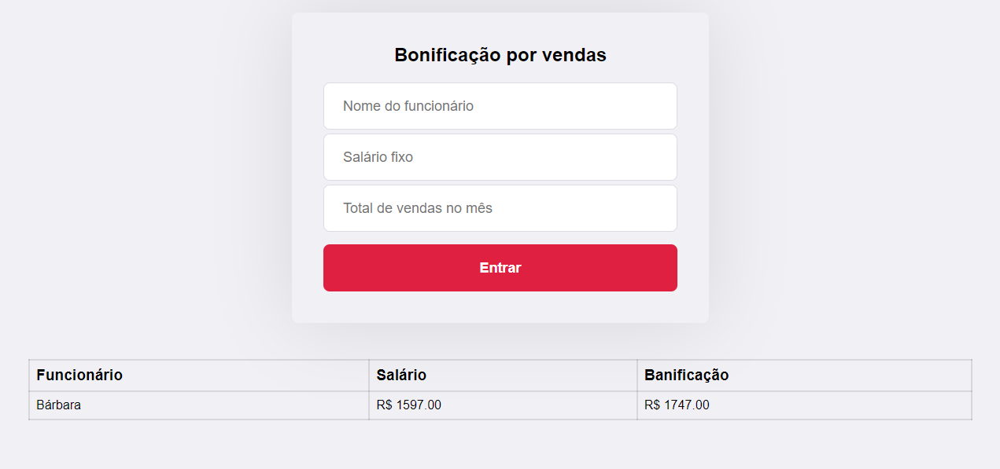

<p align="center">
  <a href="#-tecnologias">🚀 Tecnologias</a>&nbsp;&nbsp;&nbsp;|&nbsp;&nbsp;&nbsp;
  <a href="#-projeto">💻 Projeto</a>
</p>

<br>

<p align="center">
  
</p>

<br/>

<p align="center">
  Projeto desenvolvido para seleção do programa Gobeyond da Corebiz!
</p>

<br/>

## 🚀 Tecnologias

Esse projeto foi desenvolvido com as seguintes tecnologias:

### Front-end

- HTML
- CSS
- JavaScript
- ReactJS

### Back-end

- Node js
- Cors
- Express
- Knex
- Sqlite 3
- Nodemon

## 💻 Projeto

### Gobeyond

1. Monte um algoritmo

Faça um programa que leia o nome de um vendedor, o seu salário fixo e o total de vendas efetuadas por ele no mês (em dinheiro). Sabendo que este vendedor ganha 15% de comissão sobre suas vendas efetuadas, informe o total a receber no final do mês, com duas casas decimais.

2. Monte um algoritimo adicionando mais funcionários e ao resultado final mostre o nome da pessoa e formatando em tabela.

3. Transforme esse algoritimo em JavaScript.

Siga os passos abaixo caso você queira rodar o projeto na sua maquina:
```bash
#Clone the repository
$ git clone https://github.com/Everton-Afonso/CorebizDesafio-2.git

# Install the dependencies
Entre na pasta do Back-end e execute o seguinte comando $ npm i ou yarn, execute o mesmo comando para a pasta do Front-end.

# Start the project
Entre na pasta do Back-end e execute o seguinte comando $ yarn start, execute o mesmo comando para a pasta do Front-end para rodar o servidor.
```
O Fron-end está rodando o servidor na PORT 3000, já o Back-end esta rodando o servidor na PORT 3333.

